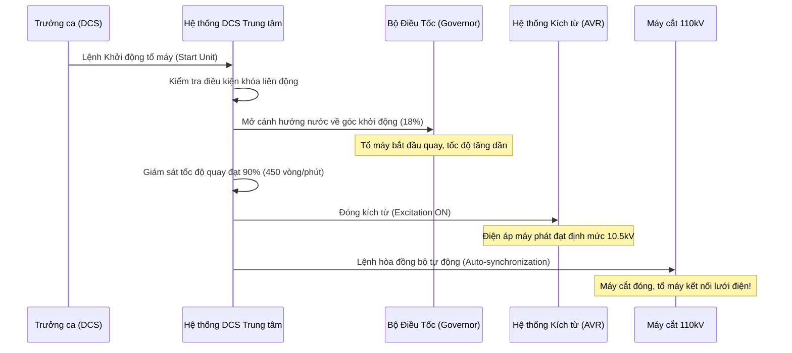

# Quy trình Khởi động Tổ máy phát điện

Quy trình này áp dụng cho nhân viên vận hành (Trưởng ca, Trưởng kíp và Nhân viên phụ trợ) khi khởi động tổ máy H1 hoặc H2 từ trạng thái dừng máy bình thường (Normal Standby) sang chế độ phát điện hòa vào lưới 110kV.

---

## I. Công tác chuẩn bị và kiểm tra trước khi khởi động

Trước khi khởi động, nhân viên vận hành phải trực tiếp xuống hiện trường kiểm tra các hạng mục sau và tích vào bảng kiểm tra (Checklist):

- [ ] **Hệ thống phanh roto:** Áp lực khí nén phanh đạt 0.6 MPa, phanh đã được giải phóng hoàn toàn (má phanh lùi về vị trí ban đầu).
- [ ] **Hệ thống nước mát (Cooling Water):** Van chặn nước mát stato và bạc đỡ đã mở. Áp lực nước làm mát đạt 0.25 - 0.35 MPa.
- [ ] **Hệ thống dầu bôi trơn:** Mức dầu trong bồn bạc hướng và bạc đỡ nằm trong phạm vi kính thủy lực quy định. Nhiệt độ dầu không thấp hơn 15°C.
- [ ] **Hệ thống điều tốc (Governor oil):** Áp lực dầu áp lực tích năng đạt 4.0 MPa. Bơm dầu điều tốc để ở chế độ tự động (AUTO).
- [ ] **An toàn hiện trường:** Không có người làm việc tại khu vực tổ máy, các tiếp địa lưu động đã tháo và các phiếu công tác liên quan đã khóa hoàn toàn.

---

## II. Điều kiện liên khóa khởi động tổ máy (Interlock Conditions)

Hệ thống điều khiển máy tính giám sát (DCS) chỉ cho phép thực hiện lệnh khởi động khi thỏa mãn đồng thời các điều kiện khóa liên động sau:

```
1. Áp lực dầu điều tốc > 3.8 MPa
2. Áp lực nước mát > 0.22 MPa
3. Áp lực khí nén phanh = 0 (Van xả phanh đã mở)
4. Van cầu đầu vào tuabin (Inlet Valve) đã mở hoàn toàn
5. Trạng thái bảo vệ rơ-le 86T và 86G bình thường (Reset)
6. Khóa chuyển mạch chế độ tại tủ LCP đặt ở vị trí "DCS/Remote"
```

---

## III. Trình tự Thao tác Khởi động Tự động (Qua DCS)

Khi các điều kiện liên khóa đã được thỏa mãn đầy đủ, Trưởng ca thực hiện thao tác trên máy tính DCS:



:::important Thời gian hòa đồng bộ giới hạn
Nếu sau **03 phút** kể từ lúc tổ máy đạt tốc độ 100% định mức mà hệ thống hòa đồng bộ tự động không thể đóng máy cắt hòa lưới, Trưởng ca phải ra lệnh hủy hòa đồng bộ và chuyển sang chế độ hòa bằng tay hoặc đưa tổ máy về trạng thái dừng không tải để kiểm tra sự lệch tần số hoặc điện áp của hệ thống lưới.
:::
