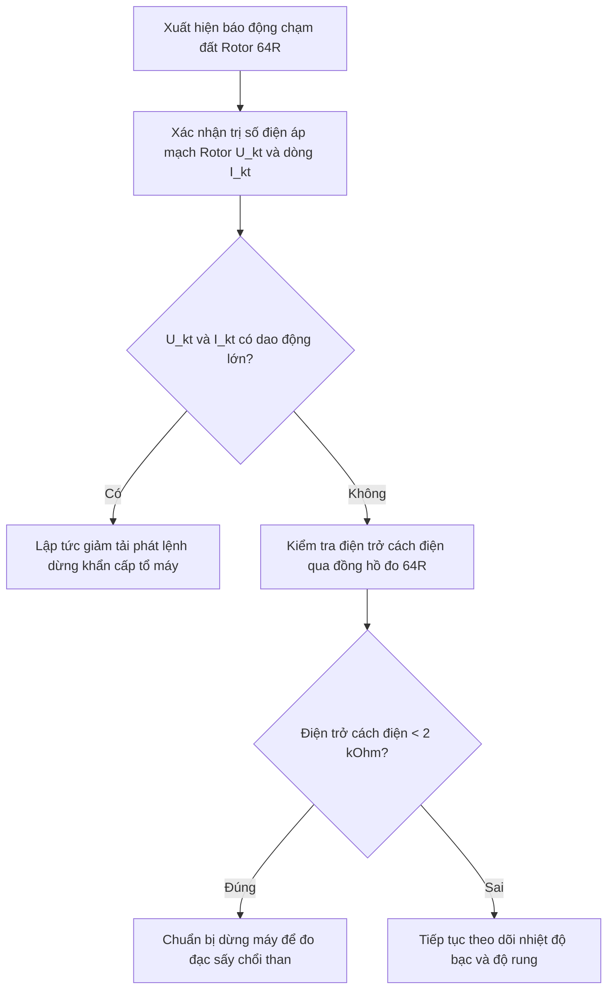

# Bảo vệ Hệ thống Kích từ & Rotor Máy phát

Tài liệu này hướng dẫn các chức năng bảo vệ tự động của hệ thống kích từ tĩnh và quy trình xử lý sự cố khi xảy ra các cảnh báo quá kích thích hoặc chạm đất mạch điện rotor máy phát.

---

## I. Các chức năng Bảo vệ kích từ chính

Mạch bảo vệ kích từ được tích hợp trong rơ-le số của tủ AVR và rơ-le bảo vệ máy phát chính, bao gồm:

1. **Bảo vệ Quá kích từ (Over-excitation Protection - OEL):**
   - *Nguyên lý:* Bảo vệ cuộn dây rotor khỏi bị quá nhiệt khi dòng điện kích từ vượt quá giới hạn định mức trong thời gian dài.
   - *Tác động:* Nếu I_kt > 480 A kéo dài quá 15 giây, hệ thống AVR tự động giảm dòng kích từ về giá trị giới hạn định mức 420 A. Nếu dòng kích từ vẫn vượt quá và nhiệt độ rotor tăng cao, rơ-le sẽ phát lệnh cắt máy cắt đầu cực cắt kích từ tổ máy.
2. **Bảo vệ Thiếu kích từ (Under-excitation Protection - UEL):**
   - *Nguyên lý:* Ngăn ngừa máy phát rơi vào trạng thái phát công suất vô công âm quá giới hạn, mất đồng bộ chuyển sang chế độ máy phát dị bộ.
   - *Tác động:* Giới hạn dòng kích từ tối thiểu không thấp hơn 110 A khi máy phát đang hòa lưới.
3. **Bảo vệ Chạm đất Rotor (Rotor Earth Fault Protection - 64R):**
   - *Nguyên lý:* Giám sát điện trở cách điện của mạch điện một chiều rotor máy phát đối với trục quay (đất).
   - *Ngưỡng tác động:*
     - Cảnh báo chạm đất điểm thứ nhất (First Point Earth Fault): Khi điện trở cách điện giảm xuống dưới 10 kilo-ohm.
     - Dừng máy cắt kích từ khi chạm đất điểm thứ hai (Second Point Earth Fault): Khi xảy ra chạm đất điểm thứ hai, dòng điện ngắn mạch rotor tăng cao gây rung giật mạnh roto cơ khí phá hủy ổ bạc.

---

## II. Quy trình xử lý Cảnh báo Chạm đất Rotor điểm thứ nhất

Khi xuất hiện tín hiệu đèn nhấp nháy "Rotor Ground Fault 64R" tại buồng điều khiển trung tâm DCS:

### Các bước xử lý của vận hành viên:
1. **Bước 1:** Kiểm tra ngay thông số dòng điện, điện áp kích từ rotor trên màn hình DCS xem có dao động lớn hoặc bất thường không. Kiểm tra độ rung cơ khí trục tổ máy.
2. **Bước 2:** Cử nhân viên vận hành phụ trợ trực tiếp đi kiểm tra chổi than máy phát:
   - Quan sát xem có hiện tượng phóng tia lửa điện lớn tại vành trượt chổi than rotor không.
   - Kiểm tra xem bột chổi than carbon có bám dày gây ẩm ướt rò điện cách điện của giá đỡ chổi than không.
3. **Bước 3:** Nếu dòng điện, điện áp rotor và độ rung máy phát bình thường:
   - Đo điện trở cách điện thực tế của rotor thông qua thiết bị đo chuyên dụng tại tủ AVR.
   - Nếu trị số cách điện phục hồi ổn định, tiếp tục cho tổ máy vận hành và đưa vào danh sách theo dõi đặc biệt.
   - Nếu trị số điện trở cách điện tiếp tục suy giảm dưới 2 kilo-ohm và xuất hiện dao động dòng kích từ nhẹ, báo cáo xin dừng máy chủ động để vệ sinh vành trượt, thay chổi than mòn hoặc sấy khô cuộn dây rotor.

:::danger Sự nguy hiểm của chạm đất điểm thứ hai
Tuyệt đối không được phép duy trì tổ máy chạy dài ngày khi đã bị cảnh báo chạm đất rotor điểm thứ nhất. Nếu điểm chạm đất thứ hai xuất hiện, từ trường cực nam châm của rotor sẽ bị lệch tâm nghiêm trọng, gây ra lực hút cơ học không đối xứng cực lớn giữa rotor và stator, làm cong trục tổ máy và phá hủy hoàn toàn bạc đỡ ổ trục chỉ trong vài giây.
:::
