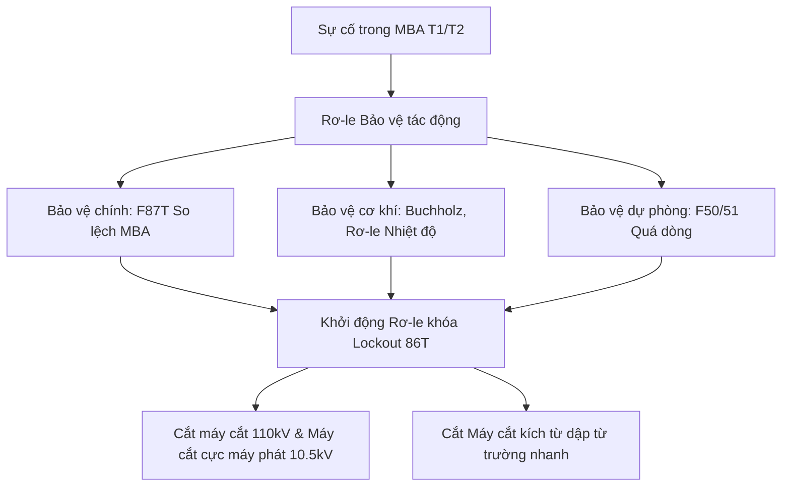

# Cấu hình Hệ thống Rơ-le Bảo vệ Sân phân phối 110kV

Hệ thống rơ-le bảo vệ kỹ thuật số đa chức năng đảm bảo phát hiện kịp thời các sự cố ngắn mạch, chạm đất, quá tải trên máy biến áp lực chính và đường dây truyền tải 110kV để cô lập vùng sự cố nhanh nhất.

---

## I. Phân vùng Bảo vệ Máy biến áp chính T1/T2

Mạch bảo vệ máy biến áp lực chính T1/T2 được chia thành hai nhóm rơ-le bảo vệ chính và dự phòng đặt tại tủ điều khiển LCP:

### Các chức năng bảo vệ chi tiết (Mã ANSI):
1. **F87T - Bảo vệ So lệch dòng điện dọc máy biến áp:**
   - *Nguyên lý:* So sánh dòng điện đi vào đầu cao thế 110kV và đi ra đầu hạ thế 10.5kV. Khi dòng điện lệch pha vượt ngưỡng cài đặt (do chạm chập cuộn dây bên trong thân máy), rơ-le tác động cắt ngay lập tức (thời gian < 40 miligiây).
2. **F96 - Rơ-le hơi Buchholz (Bảo vệ cơ khí):**
   - *Nguyên lý:* Đặt trên ống dẫn dầu nối giữa thùng chính máy biến áp và bình dầu phụ. Khi có phóng điện sinh nhiệt làm phân hủy dầu sinh ra bọt khí, rơ-le hơi sẽ tác động.
   - *Mức tác động:*
     - Cấp 1 (Cảnh báo): Báo động có khí tích tụ nhẹ.
     - Cấp 2 (Cắt máy): Dòng dầu di chuyển nhanh đột ngột qua rơ-le sang bình phụ, kích hoạt rơ-le khóa 86T cắt ngay máy biến áp.
3. **F50G/51G - Bảo vệ quá dòng chạm đất có hướng phía 110kV:**
   - *Mục đích:* Bảo vệ dự phòng cho cuộn dây đấu hình Sao nối đất trực tiếp phía 110kV khi xảy ra sự cố chạm đất một pha trên đường dây truyền tải.

---

## II. Phân vùng Bảo vệ Đường dây 110kV đi Quy Nhơn / Hoài Nhơn

Đường dây truyền tải 110kV được trang bị hai loại rơ-le bảo vệ độc lập, dự phòng lẫn nhau:

- **F87L - Bảo vệ So lệch dọc đường dây (Line Differential Protection):**
   - Sử dụng cáp quang liên lạc để so sánh dòng điện hai đầu trạm Vĩnh Sơn và trạm Quy Nhơn. Khi dòng điện so lệch khác 0, rơ-le tác động cắt máy cắt đường dây hai đầu đồng thời.
- **F21 - Bảo vệ Khoảng cách (Distance Protection):**
   - Rơ-le đo tỷ số tổng trở đường dây (tỷ số U/I). Khi xảy ra sự cố ngắn mạch trên đường dây, tổng trở đo được giảm mạnh.
   - *Phân vùng bảo vệ (Zones):*
     - Vùng 1 (Zone 1): Bảo vệ 80% chiều dài đường dây, tác động cắt tức thời (0.0 giây).
     - Vùng 2 (Zone 2): Bảo vệ 100% đường dây + 20% trạm đối diện, tác động cắt có trễ (0.35 giây).
     - Vùng 3 (Zone 3): Bảo vệ dự phòng từ xa, cắt có trễ (1.2 giây).

:::danger Quy tắc xử lý rơ-le khóa Lockout 86T
Rơ-le khóa 86T (Lockout Relay) là loại rơ-le tự giữ tiếp điểm cơ khí. Khi 86T đã tác động, nó sẽ khóa cứng mạch điều khiển đóng máy cắt. Vận hành viên tuyệt đối không được phép Reset rơ-le 86T bằng nút nhấn cơ trên mặt tủ khi chưa nhận được biên bản thí nghiệm đo điện trở cách điện và kiểm tra mẫu khí trong dầu máy biến áp xác nhận bình thường.
:::
