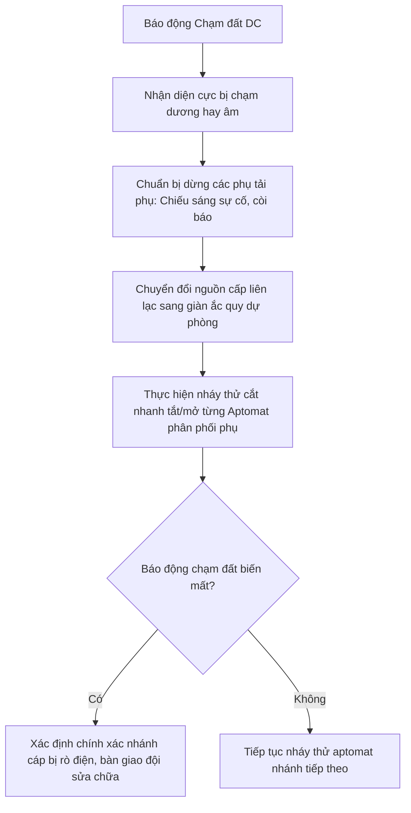

# Quy trình Giám sát Cách điện và Dò tìm Chạm đất DC

Nguồn điện một chiều 220VDC điều khiển của nhà máy là hệ thống nguồn trung tính cách ly hoàn toàn đối với đất. Việc giám sát độ cách điện của cực dương (+) và cực âm (-) đối với đất có vai trò sống còn để ngăn ngừa hiện tượng rơ-le bảo vệ tác động sai hoặc từ chối cắt sự cố.

---

## I. Nguy cơ khi xảy ra chạm đất nguồn một chiều DC

- **Chạm đất 1 điểm (Single Point Ground Fault):** Hệ thống nguồn DC vẫn hoạt động bình thường, không xảy ra dòng ngắn mạch. Tuy nhiên, nếu không xử lý kịp thời, điểm chạm đất thứ hai xuất hiện sẽ dẫn đến sự cố nghiêm trọng.
- **Chạm đất 2 điểm (Double Point Ground Fault):** Nếu chạm đất xảy ra đồng thời ở cả cực dương và cực âm ở các vị trí khác nhau:
  - *Tác động sai rơ-le:* Dòng điện chạm đất có thể chạy tắt qua cuộn cắt của máy cắt cao áp, tự động cắt máy cắt hòa lưới gây gián đoạn phát điện vô cớ.
  - *Từ chối cắt máy cắt:* Ngược lại, nếu sự cố xảy ra, cuộn cắt máy cắt bị ngắn mạch cầu bởi 2 điểm chạm đất dẫn đến máy cắt không thể cắt sự cố, gây nổ cháy lan máy biến áp chính.

---

## II. Hệ thống Giám sát Cách điện Tự động (Insulation Monitor)

Tủ nguồn DC chính được trang bị thiết bị giám sát cách điện tự động liên tục đo trị số điện trở cách điện của cực (+) và cực (-) đối với đất:

- **Trị số cách điện bình thường:** R_cd >= 50 kilo-ohm.
- **Trị số Cảnh báo Chạm đất Dương (+):** Khi R_cd cực (+) đối với đất giảm xuống ≤ 25 kilo-ohm.
- **Trị số Cảnh báo Chạm đất Âm (-):** Khi R_cd cực (-) đối với đất giảm xuống ≤ 25 kilo-ohm.

---

## III. Quy trình dò tìm vị trí Chạm đất nguồn DC thủ công

Khi tủ nguồn phát còi báo động và hiển thị đèn "DC Ground Fault (+)" hoặc "(-)" rực sáng, Trưởng ca phải chỉ đạo lập tức công tác dò tìm nhánh cáp rò điện theo phương pháp phân vùng cô lập tạm thời:

### Các bước thao tác chi tiết:
1. **Bước 1:** Báo cáo Kỹ sư trưởng và Điều độ viên ca trực (xin phép nháy thử nguồn DC điều khiển một số nhánh phụ tải không nguy hại).
2. **Bước 2:** Cắt cô lập các phụ tải phụ trước: Hệ thống chiếu sáng sự cố, hệ thống còi chuông báo động, hệ thống sấy tủ điều khiển. Giám sát xem báo động chạm đất có biến mất không.
3. **Bước 3:** Nháy thử cắt nhanh và đóng lại ngay (thời gian nhỏ hơn 1.5 giây) từng Aptomat (MCB) cấp nguồn DC tại tủ phân phối chính:
   - *Lưu ý:* Thao tác nháy nhanh không làm mất nguồn các rơ-le số thông minh nhờ rơ-le có tụ điện lưu năng lượng tự nuôi trong khoảng 2.0 giây.
4. **Bước 4:** Khi cắt đến một nhánh nào đó mà trị số điện trở cách điện trên đồng hồ tủ sạc phục hồi về trên 50 kilo-ohm và còi báo động tắt:
   - Nhánh đó chính là nhánh có điểm dây bị tróc vỏ rò điện chạm đất.
   - Trưởng ca ra lệnh cô lập nhánh sự cố, chuyển đổi nguồn cấp dự phòng cho rơ-le từ thanh cái liên lạc và bàn giao cho Phân xưởng Đo lường Tự động đi tuần dọc tuyến cáp tìm điểm rò điện sửa chữa.

:::danger Tuyệt đối cấm thao tác khi không có găng tay
Khi thao tác dò tìm chạm đất DC tại tủ điện, vận hành viên phải đeo găng tay cao su cách điện chuyên dụng và đứng trên thảm cao su cách điện. Tuyệt đối không dùng tay trần sờ vào các điểm nối thanh cái đồng để tránh giật điện và đề phòng chạm đất lan truyền.
:::
